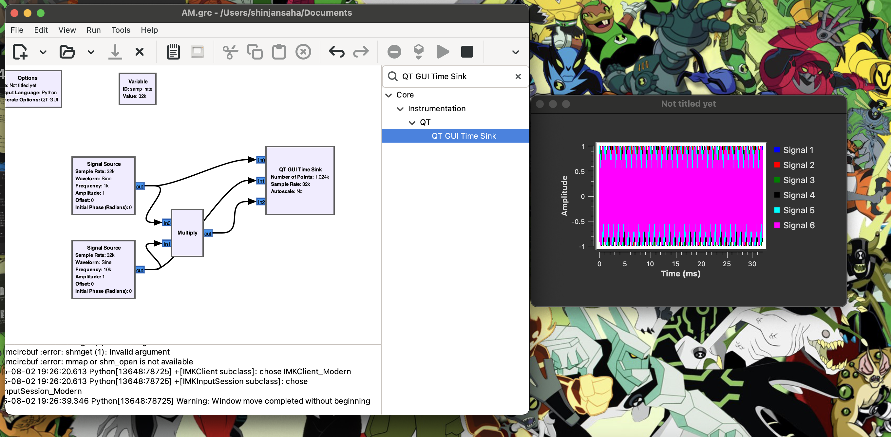

# GNU Radio AM Modultation & Demodultation

## 📡 QT GUI Time Sink Signal Descriptions

This project uses GNU Radio Companion to perform basic **AM Modulation**, and visualizes the signals using the `QT GUI Time Sink`. Below is a breakdown of the input signals connected to the sink:

| Signal        | What it is                             | Connection Source              |
|---------------|-----------------------------------------|--------------------------------|
| **Signal 1** (Blue)     | Message signal — 1 kHz sine wave         | Direct from **Signal Source 1** |
| **Signal 2** (Red)      | Carrier signal — 10 kHz sine wave        | Direct from **Signal Source 2** |
| **Signal 3** (Cyan/Magenta) | AM Modulated output — product of the two | From **Multiply block output**   |

> ℹ️ The signal colors (blue, red, cyan/magenta) may vary slightly depending on your GNU Radio theme or system palette.

### 🛠️ How It Works

- The **Message Signal** is a low-frequency sine wave that represents the information to be transmitted.
- The **Carrier Signal** is a high-frequency sine wave that "carries" the message.
- The **Multiply block** performs the amplitude modulation by multiplying the two signals together.

You can view all these in real-time via the `QT GUI Time Sink`, which provides a clear visualization of the modulation process.

## Output

